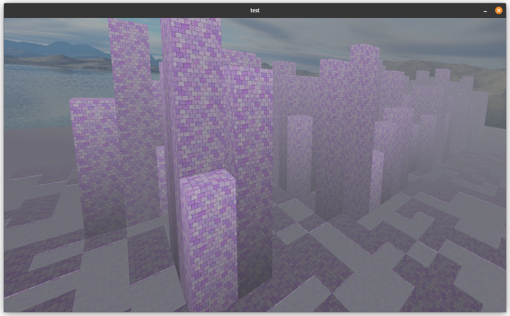

C++/SFML/OpenGL

My attempt in understanding OpenGL.

[This](https://bisqwit.iki.fi/jutut/kuvat/programming_examples/75000/) was used as a guide.
Buildings are generated in a foggy world.
Camera is movable. 
Buildings are random.

